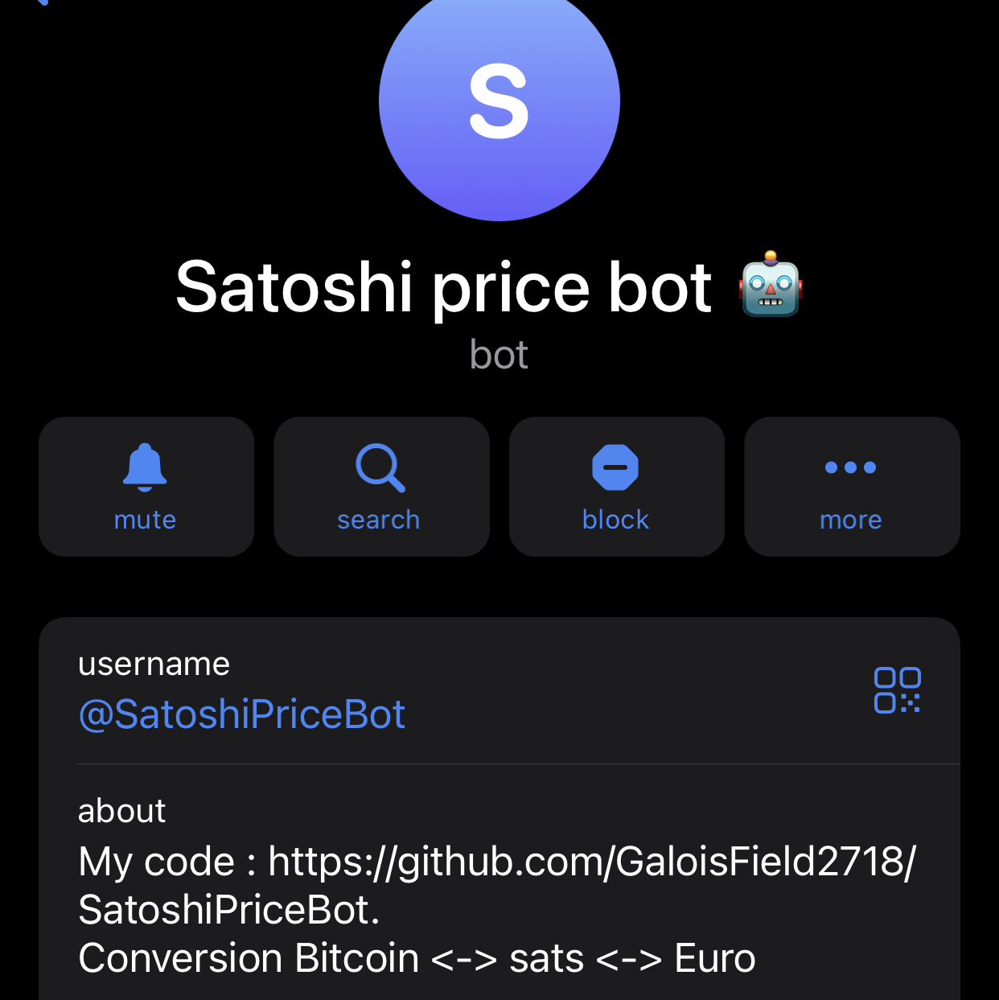

### Hi there 👋

<!--
**GaloisField2718/GaloisField2718** is a ✨ _special_ ✨ repository because its `README.md` (this file) appears on your GitHub profile.

Here are some ideas to get you started:

- 🔭 I’m currently working on ...
- 🌱 I’m currently learning ...
- 👯 I’m looking to collaborate on ...
- 🤔 I’m looking for help with ...
- 💬 Ask me about ...
- 📫 How to reach me: ...
- 😄 Pronouns: ...
- ⚡ Fun fact: ...

Stacks : https://ileriayo.github.io/markdown-badges/
-->

🧮 I'm **GaloisField**, [@Blockcryptology](https://twitter.com/Blockcryptology), 📩 [galoisfield2718@gmail.com](mailto:galoisfield2718@gmail.com?subject=I%20want%20to%20talk%20with%20you%20about...).

🏆 I won 2️⃣ Brussels Blockchain Hackathon with [ResearchDAO](https://github.com/fulmini/ResearchDAO) and [TweetX](https://github.com/tweetnfts/TweetX).

🤝 Very involved in the **Bitcoin** community as in the **Blockchain space**. 

I attended to [👉](https://b.tc/conference/amsterdam) 

🧰 I built some tools as [Telegram Converter Bot](https://github.com/GaloisField2718/SatoshiPriceBot), [Email saver for Bitcoin-dev Digest](https://github.com/GaloisField2718/Bitcoin-dev-digest) and few other you can find on my profile. 

|| |
|:--|:--|

🧑‍💻 Every hackathon has its own repository and I try to specify them in the description 💬. Feel free to check some of them and fork it 🍴 as you need.

🧑‍🎓 Actual student in Master Computer Sciences, I hope to shape tomorrow Blockchain tools. 

📆 Actually mainly involved with new protocols on top of Bitcoin and projects on top of them : [Ordinals](github.com/ordinals/ord) and [Atomicals-js](github.com/atomicals/atomicals-js) for example. But I'm making some tests also on [Near Protocol](near.org), their command line is really cool and should be tested [near-cli-rs](https://github.com/near/near-cli-rs)

## Some stack 📚

## Thanks 🙏

Unfortunately [Rix AI | Hashnode](https://hasnode.com/rix) which were providing **Claude 2 AI** for free and available everywhere without limitations, is not available anymore... 😢 I was a big fan, but I will need to take a subscription to ChatGPT 😭 Or... [janhq/jan: Jan is an open source alternative to ChatGPT that runs 100% offline on your computer](https://github.com/janhq/jan) could be THE SOLUTION with [Mistral AI | Open-weight models](https://mistral.ai/) could do the job 😄

Thank you also to [goosinals team](https://magiceden.io/ordinals/marketplace/goosinals) for sending me a goosinals version of my pfp \
. 

And also a BIG THANK YOU for all the community who are thinking, discussing and building on **Bitcoin** and **Blockchain Protocols**. The community is very kind with smart and interesting people. So, big thank you to everyone I have met and I hope to meet in the future ! 😘

## Some Youtube recommendations
[Bitcoin Core Playlist](https://youtube.com/playlist?list=PLvBkrcxK_me63-XOo0L-bqYHInLGG3UBV&si=awWZOcMftDaxhILQ)

[Ordinals node setup | pazNGMI](https://www.youtube.com/@pazNGMI)

